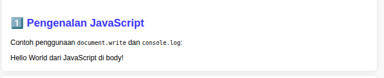
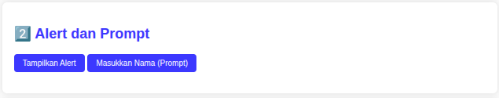
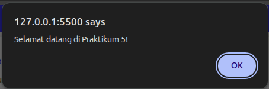
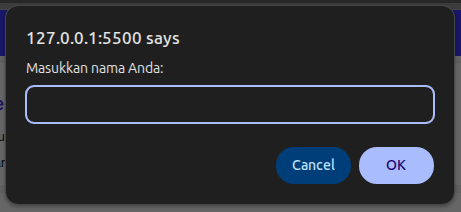
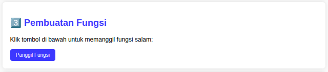
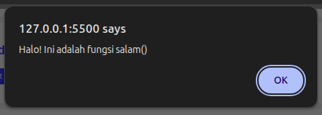
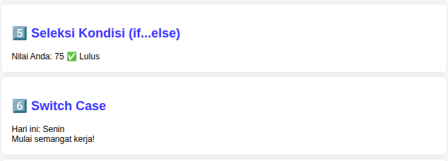
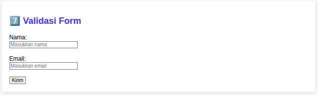
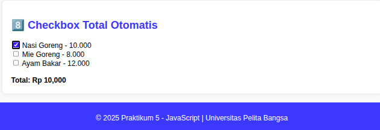

# Lab5Web
Nama: Muhammad Hafiyainul Yakin Wahid
Nim: 312410164

### Praktikum 5: JavaScript

Praktikum ini bertujuan agar mahasiswa memahami dasar penggunaan JavaScript dalam halaman web, meliputi sintaks dasar, manipulasi elemen HTML, penggunaan fungsi, kondisi, dan validasi form.

### Tujuan

Memahami sintaks dasar JavaScript

Memahami penggunaan JavaScript di halaman web

Membuat kode JavaScript sederhana

Mampu memanipulasi elemen HTML (DOM)

### Langkah-langkah Praktikum

Buat folder lab5_javascript dan dua file: index.html dan eksternal.js.

### kode index.html:

```html
<!DOCTYPE html>
<html lang="id">
<head>
  <meta charset="UTF-8">
  <meta name="viewport" content="width=device-width, initial-scale=1.0">
  <title>Praktikum 5 - JavaScript</title>
  <script src="eksternal.js"></script>
</head>
<body>
  <h1>Pengenalan JavaScript</h1>
  <script>
    document.write("Hello World<br>");
    console.log("Hello World");
  </script>
  <button onclick="alert('Selamat datang di Praktikum 5!')">Tampilkan Alert</button>
  <button onclick="mintaNama()">Masukkan Nama</button>
  <p id="hasilNama"></p>
  <script>
    function mintaNama() {
      let nama = prompt("Masukkan nama Anda:");
      if (nama) {
        document.getElementById("hasilNama").innerHTML = "Halo, " + nama + "!";
      }
    }
    function salam() {
      alert("Halo dari fungsi salam()");
    }
  </script>
  <button onclick="salam()">Panggil Fungsi</button>
  <script>
    let a=8,b=4;
    document.write("a="+a+", b="+b+"<br>");
    document.write("Penjumlahan: "+(a+b)+"<br>");
    let nilai=75;
    if(nilai>=70){document.write("Nilai: "+nilai+" ✅ Lulus<br>");}
    else{document.write("Nilai: "+nilai+" ❌ Tidak Lulus<br>");}
    let hari="Senin";
    document.write("Hari ini: "+hari+"<br>");
    switch(hari){
      case "Senin":document.write("Mulai semangat kerja!<br>");break;
      default:document.write("Hari biasa...<br>");
    }
  </script>
  <h2>Form Validasi</h2>
  <form onsubmit="return validasi()">
    <input type="text" id="nama" placeholder="Nama"><br><br>
    <input type="email" id="email" placeholder="Email"><br><br>
    <input type="submit" value="Kirim">
  </form>
  <script>
    function validasi(){
      let nama=document.getElementById("nama").value;
      let email=document.getElementById("email").value;
      if(nama==""||email==""){alert("Semua field wajib diisi!");return false;}
      alert("Data berhasil dikirim!");return true;
    }
  </script>
  <h2>Checkbox Total Otomatis</h2>
  <form name="formMakanan">
    <input type="checkbox" value="10000" onclick="hitungTotal()"> Nasi Goreng - 10.000<br>
    <input type="checkbox" value="8000" onclick="hitungTotal()"> Mie Goreng - 8.000<br>
    <input type="checkbox" value="12000" onclick="hitungTotal()"> Ayam Bakar - 12.000<br><br>
    <b>Total: Rp <span id="total">0</span></b>
  </form>
  <script>
    function hitungTotal(){
      let total=0;let form=document.forms["formMakanan"];
      for(let i=0;i<form.length;i++){if(form[i].checked){total+=parseInt(form[i].value);}}
      document.getElementById("total").innerText=total.toLocaleString();
    }
  </script>
</body>
</html>
```

Isi file eksternal.js dengan kode berikut:

alert("Hello dari eksternal.js!");
document.write("<p>Ini teks dari eksternal JavaScript.</p>");


Jalankan file index.html di browser, lalu coba klik tombol dan isi form untuk melihat hasil interaktifnya.

Lakukan validasi HTML di http://validator.w3.org
.

Upload hasilnya ke GitHub repository dengan nama Lab5Web dan tambahkan screenshot hasil di folder img.

## Hasil Tampilan

Menampilkan "Hello World" di halaman dan di console

 
Tombol alert dan prompt bekerja

 




Fungsi salam() memunculkan pesan





Operasi aritmatika, kondisi if/else, dan switch tampil sesuai logika




Form validasi menolak input kosong 




Checkbox otomatis menghitung total harga




## Kesimpulan
JavaScript memungkinkan halaman web menjadi interaktif dan dinamis. Dengan JavaScript, kita dapat menampilkan pesan, memvalidasi form, menghitung nilai, dan memanipulasi elemen HTML secara langsung. Pemisahan file eksternal membuat kode lebih rapi dan mudah dikelola.
